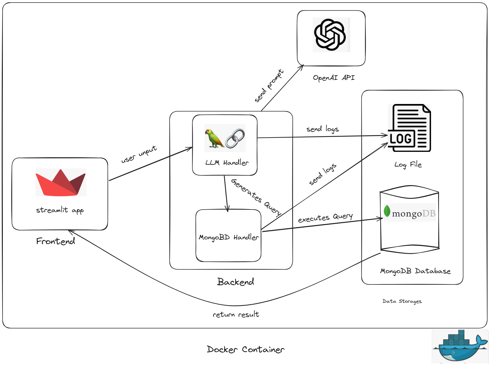
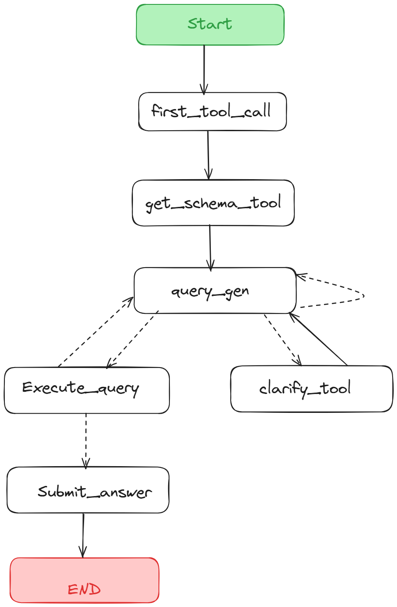
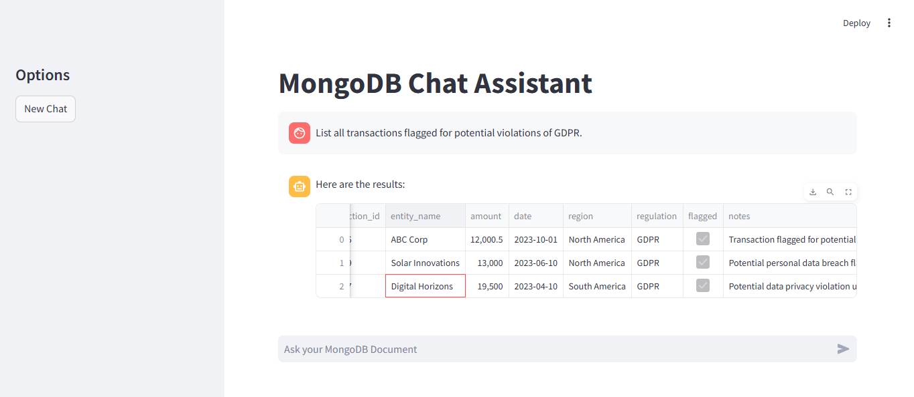
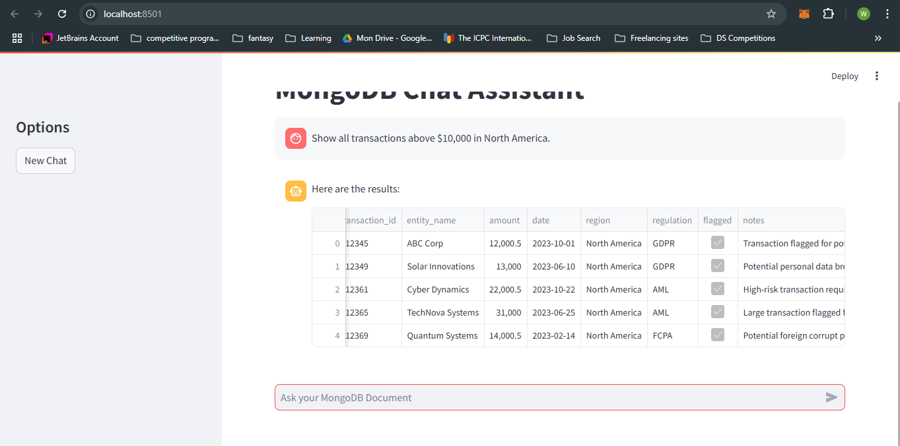
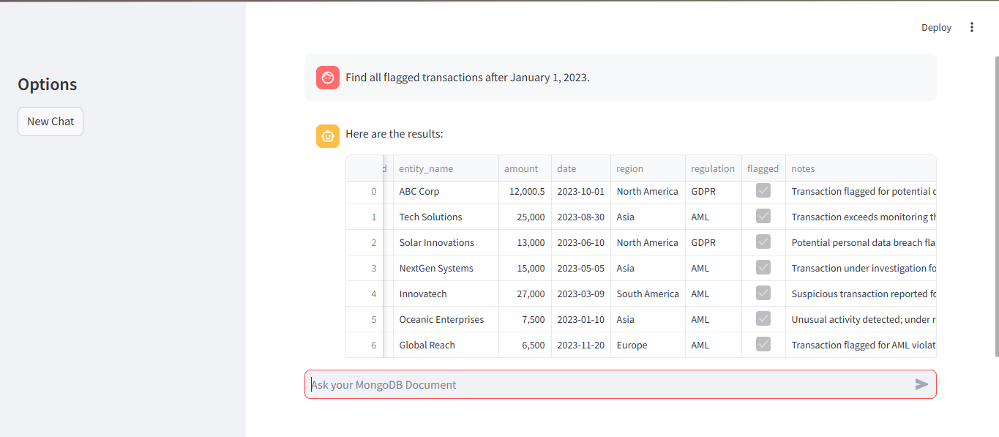
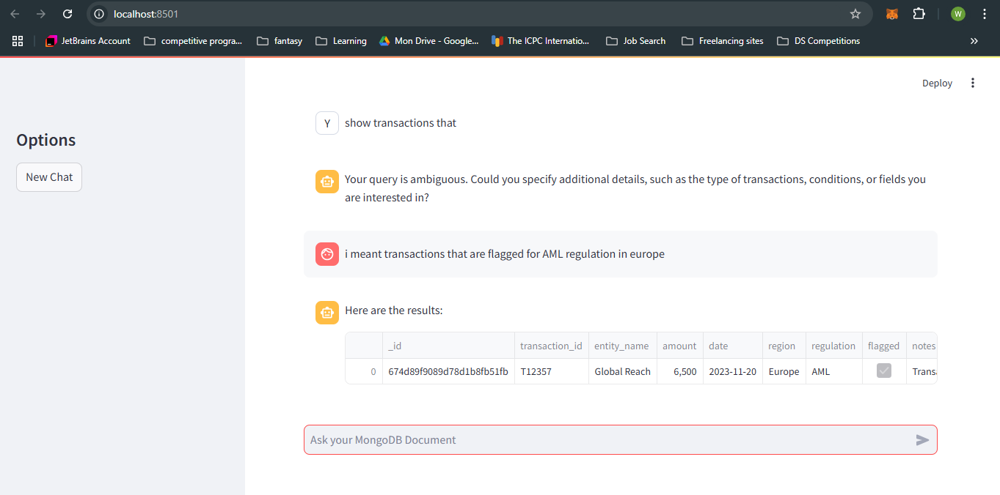
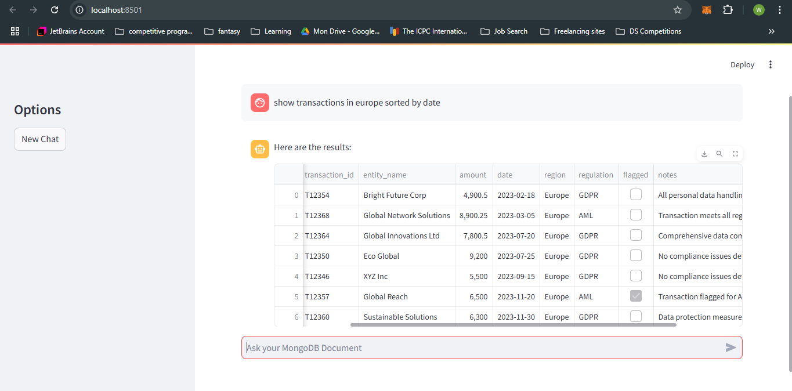

# Natural Language to MongoDB Query Converter

**A Streamlit-powered application leveraging LangChain, OpenAI GPT, and MongoDB to dynamically convert natural language queries into MongoDB commands.**

[link to canva presentation](https://www.canva.com/design/DAGYf6u_Jic/7ozCMm6IMvFJy61cSKRQLA/edit?utm_content=DAGYf6u_Jic&utm_campaign=designshare&utm_medium=link2&utm_source=sharebutton)

---

## 🚀 Features

- **Natural Language Query Processing:** Converts user input into optimized MongoDB queries using GPT models.
- **LangChain Integration:** Uses the LangGraph Agent for enhanced multi-step query workflows and decision-making.
- **User-Friendly Interface:** Built with Streamlit for a seamless and interactive user experience.
- **Robust Backend:** Handles dynamic query execution and ensures accurate database responses.
- **Dockerized Deployment:** Easy-to-use containerized setup for consistent and scalable deployment.

---

## 🛠️ Architecture Overview

The system comprises the following components:

1. **Frontend:**
   - **Streamlit App:** A lightweight interface for users to input natural language queries.

2. **Backend:**
   - **LangChain with OpenAI GPT:** Converts natural language into MongoDB queries.
   - **Database Handler:** Executes the queries and retrieves results from MongoDB.

3. **Database:**
   - **MongoDB:** Stores data and supports complex NoSQL queries.

4. **Deployment:**
   - **Dockerized Environment:** Ensures portability and consistency across systems.




**The Agent's workflow:**



---

## 📦 Installation and Setup

### Prerequisites
- You only need Docker installed on your system.

### Steps

1. **Pull the Docker Image**
   ```bash
   docker pull yousfiwissem224602/nl2mongo:latest
   ```
2. **Run the Docker Image **
   ```bash
   docker run -d -p 8080:8080 yousfiwissem224602/nl2mongo:latest
   ```
  3. **Access the application **
	  Open your browser and navigate to http://localhost:8080.

## 🛠️ How to Use

1.  Input a natural language query into the Streamlit app.
2.  Review the generated MongoDB query.
3.  View results dynamically fetched from the MongoDB database.

----------

## 🤖 Technologies Used

-   **Programming Language:** Python
-   **Framework:** Streamlit
-   **AI Model:** GPT-4o (via OpenAI API)
-   **Integration:** LangChain (LangGraph Agent,and LLM integration)
-   **Database:** MongoDB
-   **Containerization:** Docker

----
## 📷 Demo











----
## 🤝 Contributing

Contributions are welcome! Please follow these steps:

1.  Fork the repository.
2.  Create a new branch (`git checkout -b feature-branch`).
3.  Commit your changes (`git commit -m 'Add feature'`).
4.  Push to the branch (`git push origin feature-branch`).
5.  Open a pull request.
